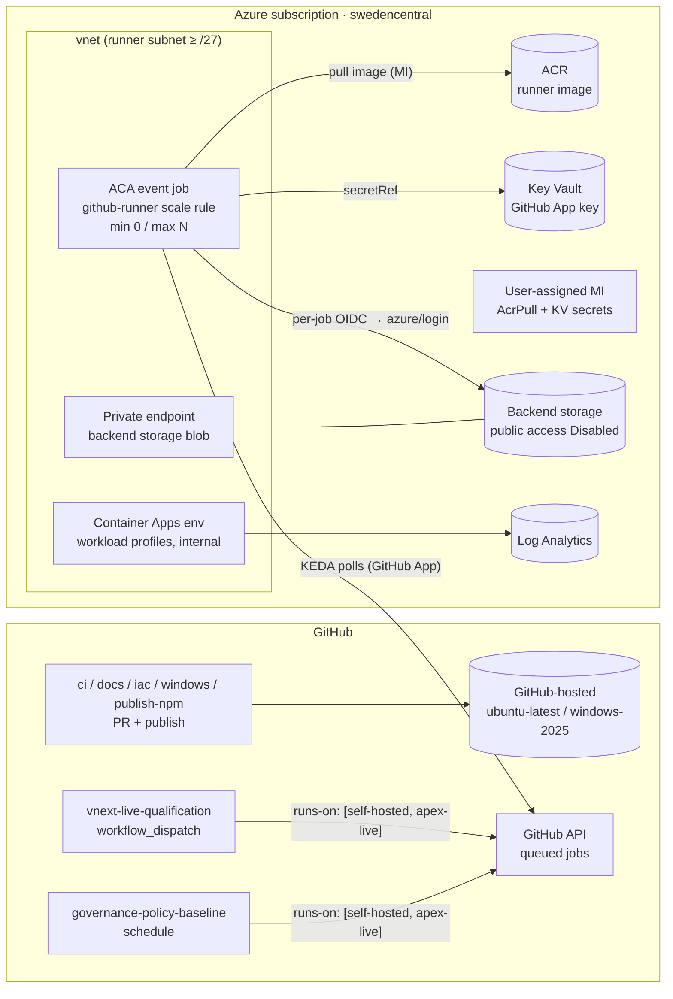

# Using Azure-hosted runners instead of free GitHub-hosted runners for `apex-vnext`

> Research date: 2026-10-07 · Repository snapshot: [jonathan-vella/apex-vnext](https://github.com/jonathan-vella/apex-vnext) @ `162107172487664d1d0f638941daca5d099e35fa`

## Executive Summary

Moving all of `apex-vnext` CI from free GitHub-hosted runners to Azure would cost more and weaken security, so it is the wrong goal. The repo appears to be public (MIT-licensed, npm trusted publishing)[^20][^5]. Standard GitHub-hosted runners are free and unlimited for public repos, and they are sized at 4 vCPU and 16 GB RAM[^44][^42]. GitHub also says self-hosted runners "should almost never be used for public repositories" because fork PRs can run code on them[^38][^39]. Several hard constraints apply:

- npm trusted publishing and `--provenance` support only cloud-hosted runners, so `publish-npm.yml` must stay on GitHub's runners[^58].
- Container Apps runners cannot run Windows or Docker-in-Docker[^31][^49].
- GitHub-hosted larger runners with Azure VNet injection require an organization on GitHub Team or Enterprise Cloud. A personal-account repo cannot use them[^29][^30].

**There is one real benefit.** `vnext-live-qualification.yml` must open the locked-down backend storage account to the whole internet during each run, because GitHub-hosted runners have no private network path[^11][^12][^16]. A runner inside an Azure VNet with a private endpoint would remove that exposure, the governance security-exception step, and the fragile cleanup logic.

**Recommendation:** use a **hybrid model**. Keep PR, docs, Windows, and publish jobs on GitHub-hosted runners. Add a small ephemeral Azure runner pool on **Azure Container Apps (ACA) event-driven jobs** in a VNet, used only by trusted manual or scheduled workflows: `vnext-live-qualification` and, optionally, `governance-policy-baseline`. The expected Azure cost for this low-volume use is a few dollars a month at most. A per-execution free grant covers most compute, and the main fixed cost is about $5/month for ACR Basic[^52][^53].

---

## 1. Current CI inventory

All 15 `runs-on:` declarations are GitHub-hosted: 14 use `ubuntu-latest` and one uses `windows-2025`. There are no self-hosted labels, runner groups, or Actions Runner Controller (ARC) configuration anywhere in the repo[^1].

| Workflow / job | Triggers | Touches Azure? | Weight | Azure-runner candidate? |
| --- | --- | --- | --- | --- |
| `ci.yml` → `ci` | push/PR (`main`, `feature/*`) | No | Medium, runs most often | ❌ PR-triggered (fork risk) |
| `ci.yml` → `windows-package-tests` | push/PR | No | 90-min budget[^1] | ❌ Windows (ACA unsupported) |
| `iac-checks.yml` (terraform, bicep) | path-filtered push/PR | No (`az bicep install` only, no login) | Light | ❌ PR-triggered |
| `docs.yml`, `branch-enforcement.yml` | PR / push | No | Light | ❌ |
| `release-candidate-qualification.yml` | path-filtered push/PR, dispatch | No | **180-min budget**[^6] | ⚠️ Only if split into a non-PR trigger |
| `vnext-live-qualification.yml` → `apply` | **`workflow_dispatch` only** | **Yes**: OIDC, az, Terraform, storage blobs[^2][^3] | 60-min, latency-bound | ✅ **Primary candidate** |
| `governance-policy-baseline.yml` | **weekly cron** + dispatch | **Yes**: OIDC, read-only ARM/policy[^4] | Light | ✅ Optional |
| `weekly-maintenance.yml` (4 jobs) | cron + dispatch | No (public fetches) | Light | ➖ No benefit |
| `publish-npm.yml` | `workflow_dispatch` | npm OIDC (not Azure) | 180-min | ❌ **Blocked by npm**[^58] |

Other relevant facts:

- **Caching:** only the built-in npm and pip caches from `setup-node` and `setup-python`. There are no `actions/cache` steps, no Docker usage, and no `services:` containers in any workflow[^7][^8].
- **Concurrency:** the workflows README staggers Monday crons "so concurrent runs do not queue behind each other on the free-tier runner pool"[^18]. The free plan allows 20 concurrent GitHub-hosted jobs[^45]. That is unlikely to bind for a single-maintainer repo.

## 2. Why "replace everything" does not pay off

### 2.1 Cost

| Item | Value | Source |
| --- | --- | --- |
| GitHub-hosted standard runners, public repo | **Free, unlimited**; Linux and Windows 4 vCPU / 16 GB / 14 GB SSD | [^44][^42] |
| Self-hosted runners (GitHub side) | Free | [^42] |
| Proposed $0.002/min self-hosted platform fee | Announced 2025-12-16 for 2026-03-01, then **postponed**. Public repos were always exempt. | [^43] |
| Hosted-runner price cut | Up to 39%, effective 2026-01-01 (took effect) | [^43] |

On a public repo, every Azure runner minute is new spending that replaces free compute. Any savings argument only holds if the repo is, or becomes, **private**. In that case GitHub-hosted runners shrink to 2 vCPU / 8 GB and are billed at $0.006/min (Linux) and $0.010/min (Windows)[^44][^29].

### 2.2 Hard blockers by job

| Blocker | Affected job(s) | Evidence |
| --- | --- | --- |
| npm trusted publishing and provenance: *"currently supports only cloud-hosted runners. Support for self-hosted runners is intended for a future release."* | `publish-npm.yml` | [^58][^5] |
| ACA requires `linux/amd64` images and does not support Windows containers | `windows-package-tests` | [^49] |
| ACA does not support Docker-in-Docker or privileged containers | None today (no Docker in CI) | [^31][^49] |
| Self-hosted runners on public repos let fork PRs execute code | Every `pull_request` job | [^38][^39] |
| Larger runners and VNet injection are org-only (Team or Enterprise Cloud) | Any "GitHub-managed in my VNet" plan | [^29][^30] |
| Runner groups are org-only (Team plan) | Can't scope runners per workflow | [^40] |
| A validator hard-codes `runs-on: ubuntu-latest` and forbids IP rules | `vnext-live-qualification.yml` | [^13][^14] |
| A validator hard-codes `windows-2025` | `windows-package-tests` | [^15] |

## 3. Where an Azure runner *does* add value: the live-qualification network hole

Today the `apply` job does this sequence[^11][^12]:

1. It checks that the backend storage account is at rest with `publicNetworkAccess: Disabled`, `defaultAction: Deny`, no IP rules, and shared key disabled.
2. It checks for an active governance security exception with at least 75 minutes remaining[^17].
3. It tags the account `SecurityControl=Ignore`, sets `--public-network-access Enabled` and `--default-action Allow`, and adds **no IP scoping**. The account is reachable from the whole internet, protected only by Entra RBAC.
4. It runs five-attempt retry loops around `blob list`, `download`, and `upload` to wait for propagation.
5. An `if: always()` step restores `Deny`/`Disabled`, removes the tag, re-verifies the final state, and fails the job if restoration did not succeed.

```yaml
# .github/workflows/vnext-live-qualification.yml (open step, abridged)
az storage account update ... --set tags.SecurityControl=Ignore
az storage account update ... --public-network-access Enabled
az storage account update ... --default-action Allow
for attempt in 1 2 3 4 5; do
  if az storage blob list --auth-mode login ... ; then exit 0; fi
  ...
done
```

This is deliberate. `validate-vnext-live-workflow.mjs` enforces the exact open and close order and **forbids** `network-rule add/remove`, because GitHub-hosted runner egress IPs cannot be enumerated[^14]. The bootstrap Bicep even grants the deployment identity a role described as *"Add and remove the ephemeral qualification runner firewall rule"*[^16].

An ACA runner in a VNet, with a **private endpoint to the backend storage account** and a private DNS zone, could keep the account `Disabled`/`Deny` permanently. That would remove:

- the public exposure window and the `SecurityControl=Ignore` exception process
- most of the propagation retry loops
- the safety-critical `set +e` restore step, along with the firewall-management role assignment

## 4. Options compared

| Option | How it works | Fits this repo? | Cost model | Maintenance |
| --- | --- | --- | --- | --- |
| **A. GitHub larger runners + Azure private networking** | GitHub-managed VMs injected into your delegated subnet (`GitHub.Network/networkSettings`)[^30] | ❌ Needs an **org on Team or Enterprise Cloud**[^29][^30]. Possible only if the repo moves to an org. | GitHub per-minute, no free minutes ($0.012/min Linux 4-core). Azure bills only network resources[^29]. | Lowest |
| **B. ACA event-driven jobs (KEDA `github-runner` scaler)** | Polls GitHub about every 30 s and starts one container per queued job, scaling to zero[^31][^32] | ✅ **Recommended for trusted Linux jobs** | Per-second vCPU/GiB with a monthly free grant[^52][^53] | Low–medium (runner image) |
| **C. ARC on AKS** | Helm-installed controller and `gha-runner-scale-set`. Ephemeral pods. DinD or Kubernetes mode.[^33] | ⚠️ Overkill for one repo | AKS nodes plus control plane (Standard $0.10/h)[^53] | Highest |
| **D. Ephemeral VMs / VMSS (DIY)** | `workflow_job` webhook → Function → VM with a JIT config; VM deletes itself after one job[^34][^35][^61] | ⚠️ Only for Windows or DinD needs | Per-second VM; Spot is cheap but evictable[^53][^57] | High (you build the autoscaler) |
| **E. Managed DevOps Pools / VMSS agents** | Azure DevOps Pipelines agents | ❌ **Not GitHub Actions**[^36] | n/a | n/a |
| **F. Third-party in your subscription (e.g., Cirun)** | SaaS creates runners in your Azure account on demand[^59] | ➖ Possible. "Always free for open source"; other pricing unverified. | Azure compute + SaaS | Low |

## 5. Recommended architecture: trusted-only ACA runner pool



### 5.1 Component checklist (aligned to repo conventions)

| Component | Recommendation | Repo convention reference |
| --- | --- | --- |
| Region | `swedencentral` | [^21] |
| Naming | `cae-{project}-{env}`, `ca-{project}-{env}` (≤32), `acr{project}{env}{suffix}` (no hyphens), `id-{project}-{env}`, `log-{project}-{env}`. VNet prefix not documented in-repo (assume CAF `vnet-`). | [^22] |
| Tags | Live Azure Policy contract first; otherwise the 9-key lowercase fallback | [^21] |
| Modules (AVM-first) | `avm/res/app/managed-environment:0.16.0`, `avm/res/app/job:0.7.2`, `avm/res/container-registry/registry:0.13.1`, `avm/res/managed-identity/user-assigned-identity:0.6.0`. These are the latest versions found; none is pinned in the repo yet. | [^50][^25] |
| Environment | **Workload-profiles** environment (supports UDR, NAT gateway, private endpoints; subnet ≥ /27). The legacy consumption-only environment can't control egress. | [^49] |
| Job sizing | Consumption: up to 4 vCPU / 8 GiB per replica. Live qualification is latency-bound, so 2 vCPU / 4 GiB is enough. | [^49] |
| `replicaTimeout` | Higher than the 60-min job timeout, e.g. 3900 s | [^2][^31] |
| ACR | Admin user disabled, MI pull via `registries[].identity`. Watch the AVM pitfall: `networkRuleSetDefaultAction: 'Deny'` is Premium-only, so on Basic set `Allow` explicitly or use Premium with a private endpoint. | [^24][^31] |
| Diagnostics | Diagnostic settings on the ACA env, job, and ACR to Log Analytics (`AllMetrics` plus service categories) | [^23] |
| Federated credentials | Created through Microsoft Graph, outside Bicep/Terraform (existing pattern) | [^17] |

### 5.2 Scale-rule auth: prefer a GitHub App over a PAT

- The KEDA `github-runner` scaler supports either `personalAccessToken` or `appKey` with `applicationID` and `installationID`. Rate limits are 5,000 req/h for a PAT and 15,000 for an App. Set `repos` explicitly and use `enableEtags=true`[^32].
- A **personal account can own a GitHub App** and install it on its own repo[^60]. Runner registration needs the repo **Administration: write** permission, which covers `registration-token`, `generate-jitconfig`, and runner removal[^35][^60].
- The Microsoft tutorial only shows PAT auth. App auth through ACA's `--scale-rule-auth appKey=<secret>` follows from the generic KEDA plumbing, but Microsoft does not show it explicitly[^31][^32].
- Any identity that can *start* the job can reference its secrets. Grant a custom role with only `read` and `start/action`, not "Container Apps Jobs Contributor"[^31].

### 5.3 Illustrative Bicep (assembled from AVM schema + KEDA metadata; not an AVM test fixture)

```bicep
module runnerJob 'br/public:avm/res/app/job:0.7.2' = {
  params: {
    name: 'ca-apexrunner-prod'
    environmentResourceId: cae.outputs.resourceId
    location: 'swedencentral'
    triggerType: 'Event'
    managedIdentities: { userAssignedResourceIds: [ uami.outputs.resourceId ] }
    registries: [ { server: '${acrName}.azurecr.io', identity: uami.outputs.resourceId } ]
    secrets: [
      { name: 'gh-app-key', keyVaultUrl: '${kv.outputs.uri}secrets/gh-runner-app-key', identity: uami.outputs.resourceId }
    ]
    eventTriggerConfig: {
      parallelism: 1
      replicaCompletionCount: 1
      scale: {
        minExecutions: 0
        maxExecutions: 3
        pollingInterval: 30
        rules: [ {
          name: 'github-runner'
          type: 'github-runner'
          metadata: {
            owner: 'jonathan-vella'
            runnerScope: 'repo'
            repos: 'apex-vnext'
            labels: 'apex-live'
            enableEtags: 'true'
            applicationID: '<app-id>'
            installationID: '<installation-id>'
            targetWorkflowQueueLength: '1'
          }
          auth: [ { secretRef: 'gh-app-key', triggerParameter: 'appKey' } ]
        } ]
      }
    }
    containers: [ {
      name: 'runner'
      image: '${acrName}.azurecr.io/apex-runner:<pinned>'
      resources: { cpu: json('2.0'), memory: '4Gi' }
      env: [ /* app id, installation id, repo URL, labels; key via secretRef */ ]
    } ]
  }
}
```

The Terraform resource `azurerm_container_app_job` lists `github-runner` as an allowed `custom_rule_type`[^51].

### 5.4 Runner image (bill of materials)

Start `FROM ghcr.io/actions/actions-runner:<pinned>`. That image is Ubuntu 24.04 with only the runner, git, jq, curl, sudo, and the Docker CLI, so add the rest on top[^54]:

| Tool | Version | Needed by | Source |
| --- | --- | --- | --- |
| Node.js | 24.21.0 (exact) | live-qual CLI (`packages/cli/dist`) | [^9][^7] |
| Terraform | 1.16.3 | live-qual Terraform track | [^10] |
| Azure CLI | ≥ 2.90.0 | live-qual, governance | [^10] |
| Bicep | ≥ 0.47.16 (pin exact in the image; CI currently installs "latest") | live-qual Bicep track | [^10] |
| PowerShell 7 (`pwsh`) | any current | governance baseline script (uses az, not Az modules) | [^28] |
| jq | preinstalled | both | [^54] |
| Python 3.14, bats | only if you move `ci`-style jobs (not recommended) | `ci.yml` | [^8][^27] |

Change the sample entrypoint to use **JIT config** instead of a registration token. The container uses the App key to mint an installation token and calls `POST /repos/{owner}/{repo}/actions/runners/generate-jitconfig` with labels `apex-live`. It then runs `./run.sh --jitconfig …`, so the runner registers for exactly one job[^35][^34]. The Microsoft sample uses `config.sh --ephemeral` with a PAT-derived registration token[^31][^55].

### 5.5 Workflow and validator changes

```yaml
# vnext-live-qualification.yml → apply job
apply:
  runs-on: [self-hosted, linux, apex-live]   # was ubuntu-latest
  environment: vnext-qualification
  permissions: { contents: read, id-token: write }
  timeout-minutes: 60
```

- **Remove** the open and close firewall steps, and remove the `Storage Account Contributor`-class "firewall rule" role from the GitHub principal[^16]. Keep a lighter `if: always()` step that verifies the account is `Disabled`/`Deny`.
- **Update** `tools/scripts/validate-vnext-live-workflow.mjs` in the same change: the `runs-on` assertions at 96 and 135, and the open/close sequence assertions at 159–195[^13][^14]. Update `.azure/plan.md` and the governance-exception docs too[^17].
- Keep `validate_dispatch` on `ubuntu-latest`. It only validates inputs and needs no Azure network.
- OIDC still works per job: `azure/login` and `core.getIDToken()` behave the same way. Do **not** switch to the VM or container's managed identity for deployment, because it would be available to every job on the runner[^47].
- To keep a fallback, `runs-on: ${{ vars.X || 'ubuntu-latest' }}` or `fromJSON(vars.X)` work (`vars` is available in `runs-on`)[^46]. The validator would need to allow this.

## 6. Security requirements for this repo

1. **Never** attach Azure runners to `pull_request` jobs. Use them only for `workflow_dispatch` and `schedule` workflows that already use `environment:` and `id-token: write`[^38][^39].
2. Set **"Require approval for all external contributors"** for fork PR workflows. The first-time-contributor options can be bypassed after one trivial merged PR[^41].
3. Runners must be **ephemeral and JIT** (one job, then destroyed). GitHub recommends against persistent autoscaled runners. Forward runner logs off-box[^34].
4. Personal accounts have no runner groups, so use **distinctive labels** (`apex-live`). Without `noDefaultLabels`, KEDA also scales on the default `self-hosted,linux,x64` labels, which means a malicious `runs-on: self-hosted` could wake the pool[^32][^40]. Set `noDefaultLabels: true` and register only custom labels.
5. Keep **OIDC federated credentials scoped to `environment:` subjects**, the current pattern. Give the runner's own managed identity only AcrPull and Key Vault read[^47].
6. **Egress control:** route the workload-profiles environment through NAT Gateway or Azure Firewall. Build FQDN allowlists from `api.github.com/meta` (`actions` and `domains.actions*`), not hard-coded IPs. Allow `168.63.129.16` and `169.254.169.254`[^48][^49].
7. Keep the existing hardening: SHA-pinned actions, `contents: read` defaults, Dependabot, and CODEOWNERS on workflows. Consider adding `persist-credentials: false` to `ci.yml` and `docs.yml` checkouts.
8. **Rebuild and patch** the runner image on the weekly maintenance cadence. Dependabot does not cover Dockerfile base images unless you add the `docker` ecosystem.

## 7. Cost estimate (swedencentral, Azure Retail Prices API, USD)

| Meter | Price |
| --- | --- |
| ACA vCPU active | $0.000024 / s |
| ACA memory active | $0.000003 / GiB-s |
| ACA free grant (per subscription / month; jobs included, requests not charged) | 180,000 vCPU-s + 360,000 GiB-s |
| ACR Basic / Standard / Premium | $0.1666 / $0.6666 / $1.6666 per day |
| D4s_v5 Linux PAYG / Spot | $0.204 / $0.0377 per h |
| D4s_v5 Windows PAYG / Spot | $0.388 / $0.0718 per h |
| AKS Standard tier control plane | $0.10 / h |

Sources: [^52][^53].

| Scenario | Monthly |
| --- | --- |
| **Recommended pool:** ~8 live-qual runs × 60 min + 4 governance runs × 10 min at 2 vCPU / 4 GiB ≈ 62,400 vCPU-s | **≈ $0 compute** (within the free grant) + **≈ $5 ACR Basic** + Log Analytics ingestion (~$2.30/GB) |
| *Hypothetical* full Linux CI on ACA: 300 jobs × 15 min at 4 vCPU / 8 GiB | ≈ $27 (after grant) vs **$0** on public-repo GitHub runners |
| Always-on D4s_v5 Linux runner | $148.92 PAYG / $27.52 Spot |
| 60 Windows jobs × 33 min on ephemeral D4s_v5 | $12.80 PAYG / $2.37 Spot |
| ARC on AKS (Standard control plane alone) | $73 + nodes |

Private endpoint, private DNS, NAT Gateway, and Azure Firewall prices were **not** researched. Azure Firewall in particular can cost more than everything else combined, so evaluate NAT Gateway plus NSG first.

## 8. Implementation roadmap

| Phase | Work | Exit criteria |
| --- | --- | --- |
| 0. Confirm | Run `gh repo view jonathan-vella/apex-vnext --json visibility`. Pull real usage with `gh run list` / billing. Decide whether the goal is network posture or cost. | Goal and visibility confirmed |
| 1. Infra | New IaC project (e.g., `infra/bicep/apex-runners/`): VNet, workload-profiles CAE, UAMI, ACR, Key Vault, Log Analytics diagnostics, private endpoint + DNS for the backend storage account. Follow AVM-first, the governance contract, and `uniqueSuffix`[^25]. | `bicep build/lint` clean, preflight OK |
| 2. Image | Dockerfile from §5.4 with a JIT entrypoint. Build with `az acr build`. Pin versions. | Image passes a smoke job |
| 3. Auth | Personal GitHub App (Administration: write, Actions: read, Metadata: read); key in Key Vault; ACA job with `noDefaultLabels`. | Queued job with `apex-live` label scales 0→1→0 |
| 4. Cutover | Move the `apply` job to `[self-hosted, linux, apex-live]`. Remove the firewall dance. Update the validator, `plan.md`, and the RBAC grant. Optionally move `governance-policy-baseline`. | Live apply/destroy green with storage never public |
| 5. Operate | Weekly image rebuild, log review, PAT/App key rotation, cost alerts | Runbook documented |

**Do not migrate:** `ci.yml`, `iac-checks.yml`, `docs.yml`, `branch-enforcement.yml`, `windows-package-tests`, or `publish-npm.yml`. Migrate `release-candidate-qualification.yml` only if you split it into a trusted, non-PR trigger.

**Alternative worth considering:** move the repo into a GitHub organization on the **Team** plan. That unlocks **GitHub-hosted larger runners with Azure private networking**: GitHub-managed ephemeral VMs injected into your subnet. It solves the same private-endpoint problem with no runner image or autoscaler to maintain, and it adds runner groups. Minutes are billed ($0.012/min for Linux 4-core), but live qualification is rare[^29][^30]. Whether npm provenance accepts larger runners was not verified.

---

## Confidence Assessment

### High confidence

- Repo workflow inventory, triggers, `runs-on` values, validator constraints, and the live-qualification public-endpoint design. These come from direct file reads at a pinned SHA.
- GitHub pricing: public repos are free, self-hosted is free, and the $0.002/min fee was postponed. Quoted from primary GitHub sources.
- npm trusted publishing and provenance are blocked on self-hosted runners. Explicit npm docs.
- ACA limitations (Linux only, no DinD, 4 vCPU / 8 GiB consumption max) and KEDA scaler metadata and rate limits.
- Larger runners with private networking and runner groups require an org on Team or Enterprise.

#### Medium confidence / inferred

- **Repo visibility:** inferred as public from the MIT license, npm trusted publishing, and README tone. The sandbox could not reach `api.github.com`, so this is not confirmed. If the repo is private, the cost and security calculus changes (§2.1); requirements 3–8 in §6 still apply.
- GitHub App (`appKey`) auth on ACA scale rules: inferred from generic KEDA/ACA plumbing; Microsoft only shows a PAT example.
- The Bicep/Terraform `github-runner` snippets were assembled from documented schemas, not copied from official examples.
- OIDC `id-token: write` working on self-hosted runners is industry practice and implied by the Azure Login docs, but no GitHub page states it explicitly.
- AVM "latest" versions were read from the MCR tag list on 2026-10-07. Re-resolve them at authoring time.
- Cost of the recommended pool assumes about 8 live runs per month. Actual usage was not measured.

#### Not researched or unverified

- Prices for Azure Firewall, NAT Gateway, private endpoints, and private DNS.
- Whether ARC supports Windows runner pods.
- Cirun's non-OSS pricing.
- Whether npm provenance works on GitHub larger runners.
- Exact Packer build time and size for `actions/runner-images`.

---

## Footnotes

[^1]: [.github/workflows/ci.yml:27,76-79](https://github.com/jonathan-vella/apex-vnext/blob/162107172487664d1d0f638941daca5d099e35fa/.github/workflows/ci.yml#L27-L79). Repo-wide grep found no `self-hosted`, runner group, or ARC references; the other workflows all use `ubuntu-latest`.
[^2]: [.github/workflows/vnext-live-qualification.yml:74-77](https://github.com/jonathan-vella/apex-vnext/blob/162107172487664d1d0f638941daca5d099e35fa/.github/workflows/vnext-live-qualification.yml#L74-L77) (`apply` job: `id-token: write`, `environment: vnext-qualification`, `timeout-minutes: 60`)
[^3]: [.github/workflows/vnext-live-qualification.yml:100-120](https://github.com/jonathan-vella/apex-vnext/blob/162107172487664d1d0f638941daca5d099e35fa/.github/workflows/vnext-live-qualification.yml#L100-L120) (`azure/login` OIDC + `core.getIDToken("api://AzureADTokenExchange")`)
[^4]: [.github/workflows/governance-policy-baseline.yml:18-23,60-70](https://github.com/jonathan-vella/apex-vnext/blob/162107172487664d1d0f638941daca5d099e35fa/.github/workflows/governance-policy-baseline.yml#L18-L70)
[^5]: [.github/workflows/publish-npm.yml:17-30,94-114](https://github.com/jonathan-vella/apex-vnext/blob/162107172487664d1d0f638941daca5d099e35fa/.github/workflows/publish-npm.yml#L17-L114)
[^6]: [.github/workflows/release-candidate-qualification.yml:46-47](https://github.com/jonathan-vella/apex-vnext/blob/162107172487664d1d0f638941daca5d099e35fa/.github/workflows/release-candidate-qualification.yml#L46-L47)
[^7]: [.github/actions/setup-node-repo/action.yml:35-38](https://github.com/jonathan-vella/apex-vnext/blob/162107172487664d1d0f638941daca5d099e35fa/.github/actions/setup-node-repo/action.yml#L35-L38)
[^8]: [.github/actions/setup-python-validation/action.yml:9-16](https://github.com/jonathan-vella/apex-vnext/blob/162107172487664d1d0f638941daca5d099e35fa/.github/actions/setup-python-validation/action.yml#L9-L16)
[^9]: [config/toolchain.v1.json:19-33](https://github.com/jonathan-vella/apex-vnext/blob/162107172487664d1d0f638941daca5d099e35fa/config/toolchain.v1.json#L19-L33)
[^10]: [tools/registry/tool-version-pins.json:1-21](https://github.com/jonathan-vella/apex-vnext/blob/162107172487664d1d0f638941daca5d099e35fa/tools/registry/tool-version-pins.json#L1-L21)
[^11]: [.github/workflows/vnext-live-qualification.yml:138-151](https://github.com/jonathan-vella/apex-vnext/blob/162107172487664d1d0f638941daca5d099e35fa/.github/workflows/vnext-live-qualification.yml#L138-L151) (at-rest validation + open step)
[^12]: [.github/workflows/vnext-live-qualification.yml:281-294](https://github.com/jonathan-vella/apex-vnext/blob/162107172487664d1d0f638941daca5d099e35fa/.github/workflows/vnext-live-qualification.yml#L281-L294) (`if: always()` close + verify)
[^13]: tools/scripts/validate-vnext-live-workflow.mjs:96,134-137 (`runs-on` must be `ubuntu-latest`; ARM token step-scoped; timeout required)
[^14]: tools/scripts/validate-vnext-live-workflow.mjs:159-195 (IP rules forbidden; exact open/close sequence)
[^15]: tools/scripts/validate-github-workflows.mjs:415; tools/registry/github-workflow-contract.json:71
[^16]: [infra/bicep/vnext-qualification/bootstrap.bicep:116-153](https://github.com/jonathan-vella/apex-vnext/blob/162107172487664d1d0f638941daca5d099e35fa/infra/bicep/vnext-qualification/bootstrap.bicep#L116-L153) (backend storage posture; role "Add and remove the ephemeral qualification runner firewall rule")
[^17]: infra/bicep/vnext-qualification/.azure/plan.md:62-69,95-111,210,291-306 (OIDC-only identity, Graph-created federated credentials, Gate 4 local-only, 75-min exception)
[^18]: [.github/workflows/README.md:68-80](https://github.com/jonathan-vella/apex-vnext/blob/162107172487664d1d0f638941daca5d099e35fa/.github/workflows/README.md#L68-L80)
[^20]: [LICENSE:1-3](https://github.com/jonathan-vella/apex-vnext/blob/162107172487664d1d0f638941daca5d099e35fa/LICENSE#L1-L3) (MIT)
[^21]: [.github/copilot-instructions.md:21-47](https://github.com/jonathan-vella/apex-vnext/blob/162107172487664d1d0f638941daca5d099e35fa/.github/copilot-instructions.md#L21-L47) (regions, tags)
[^22]: .github/skills/azure-defaults/references/naming-full-examples.md:1-39
[^23]: .github/instructions/references/iac-security-baseline.md:14-40 (diagnostic settings incl. Container Registry / Container Apps / AKS)
[^24]: .github/skills/azure-defaults/references/security-baseline-full.md:54-61 (AVM ACR `networkRuleSetDefaultAction` Premium-only pitfall)
[^25]: infra/bicep/AGENTS.md:1-69; infra/terraform/AGENTS.md:1-55
[^27]: [.github/workflows/ci.yml:48-49](https://github.com/jonathan-vella/apex-vnext/blob/162107172487664d1d0f638941daca5d099e35fa/.github/workflows/ci.yml#L48-L49) (`apt-get install bats`)
[^28]: tools/scripts/collect-governance-baseline.ps1:1-13
[^29]: GitHub, Actions runner pricing: <https://docs.github.com/en/billing/reference/actions-runner-pricing>; larger runners: <https://docs.github.com/en/actions/concepts/runners/larger-runners>
[^30]: GitHub, private networking for GitHub-hosted runners: <https://docs.github.com/en/organizations/managing-organization-settings/configuring-private-networking-for-github-hosted-runners-in-your-organization>; ARM schema: <https://learn.microsoft.com/en-us/azure/templates/github.network/networksettings>
[^31]: Microsoft Learn, ACA jobs CI/CD runners tutorial: <https://learn.microsoft.com/en-us/azure/container-apps/tutorial-ci-cd-runners-jobs>
[^32]: KEDA `github-runner` scaler: <https://keda.sh/docs/2.21/scalers/github-runner/>
[^33]: GitHub ARC: <https://docs.github.com/en/actions/concepts/runners/actions-runner-controller>; <https://docs.github.com/en/actions/how-tos/manage-runners/use-actions-runner-controller/deploy-runner-scale-sets>; <https://docs.github.com/en/actions/how-tos/manage-runners/use-actions-runner-controller/authenticate-to-the-api>
[^34]: GitHub, self-hosted runners reference (ephemeral, autoscaling): <https://docs.github.com/en/actions/reference/runners/self-hosted-runners>
[^35]: GitHub REST, self-hosted runners (`generate-jitconfig`, `registration-token`): <https://docs.github.com/en/rest/actions/self-hosted-runners>
[^36]: Microsoft Learn, Managed DevOps Pools: <https://learn.microsoft.com/en-us/azure/devops/managed-devops-pools/overview>; scale set agents: <https://learn.microsoft.com/en-us/azure/devops/pipelines/agents/scale-set-agents>
[^38]: GitHub, Secure use reference (self-hosted runner hardening): <https://docs.github.com/en/actions/reference/security/secure-use>
[^39]: GitHub, Add self-hosted runners: <https://docs.github.com/en/actions/how-tos/manage-runners/self-hosted-runners/add-runners>
[^40]: GitHub, Runner groups: <https://docs.github.com/en/actions/concepts/runners/runner-groups>
[^41]: GitHub, Managing Actions settings for a repository (fork PR approval): <https://docs.github.com/en/repositories/managing-your-repositorys-settings-and-features/enabling-features-for-your-repository/managing-github-actions-settings-for-a-repository>
[^42]: GitHub, Actions billing: <https://docs.github.com/en/billing/concepts/product-billing/github-actions>
[^43]: GitHub changelog 2025-12-16 (with postponement update): <https://github.blog/changelog/2025-12-16-coming-soon-simpler-pricing-and-a-better-experience-for-github-actions/>; <https://github.com/resources/insights/2026-pricing-changes-for-github-actions>
[^44]: GitHub-hosted runners reference: <https://docs.github.com/en/actions/reference/runners/github-hosted-runners>
[^45]: GitHub Actions limits (concurrency): <https://docs.github.com/en/actions/reference/limits>
[^46]: GitHub, Choose the runner for a job: <https://docs.github.com/en/actions/how-tos/write-workflows/choose-where-workflows-run/choose-the-runner-for-a-job>; contexts: <https://docs.github.com/en/actions/reference/workflows-and-actions/contexts>; expressions: <https://docs.github.com/en/actions/reference/workflows-and-actions/expressions>
[^47]: Microsoft Learn, Connect GitHub Actions to Azure: <https://learn.microsoft.com/en-us/azure/developer/github/connect-from-azure>; GitHub OIDC: <https://docs.github.com/en/actions/concepts/security/openid-connect>
[^48]: GitHub, proxy servers for self-hosted runners: <https://docs.github.com/en/actions/how-tos/manage-runners/use-proxy-servers>; GitHub IP addresses / Meta API: <https://docs.github.com/en/authentication/keeping-your-account-and-data-secure/about-githubs-ip-addresses>
[^49]: Microsoft Learn, ACA containers: <https://learn.microsoft.com/en-us/azure/container-apps/containers>; networking: <https://learn.microsoft.com/en-us/azure/container-apps/networking>; workload profiles: <https://learn.microsoft.com/en-us/azure/container-apps/workload-profiles-overview>; jobs: <https://learn.microsoft.com/en-us/azure/container-apps/jobs>
[^50]: AVM `avm/res/app/job` README: <https://github.com/Azure/bicep-registry-modules/blob/main/avm/res/app/job/README.md>; `managed-environment`: <https://github.com/Azure/bicep-registry-modules/blob/main/avm/res/app/managed-environment/README.md>
[^51]: Terraform azurerm `container_app_job` docs: <https://github.com/hashicorp/terraform-provider-azurerm/blob/main/website/docs/r/container_app_job.html.markdown>
[^52]: Azure Container Apps pricing: <https://azure.microsoft.com/en-us/pricing/details/container-apps/>
[^53]: Azure Retail Prices API (swedencentral queries for Container Apps, VMs, Container Registry, Log Analytics, AKS): <https://prices.azure.com/api/retail/prices>
[^54]: actions/runner image Dockerfile: <https://github.com/actions/runner/blob/main/images/Dockerfile>
[^55]: Azure-Samples tutorial repo: <https://github.com/Azure-Samples/container-apps-ci-cd-runner-tutorial>
[^57]: Microsoft Learn, Spot VMs: <https://learn.microsoft.com/en-us/azure/virtual-machines/spot-vms>
[^58]: npm trusted publishers: <https://docs.npmjs.com/trusted-publishers>; provenance: <https://docs.npmjs.com/generating-provenance-statements>
[^59]: Cirun: <https://cirun.io>, <https://cirun.io/pricing>
[^60]: GitHub, permissions required for GitHub Apps: <https://docs.github.com/en/rest/authentication/permissions-required-for-github-apps>; registering a GitHub App: <https://docs.github.com/en/apps/creating-github-apps/registering-a-github-app/registering-a-github-app>
[^61]: GitHub, `workflow_job` webhook: <https://docs.github.com/en/webhooks/webhook-events-and-payloads#workflow_job>
