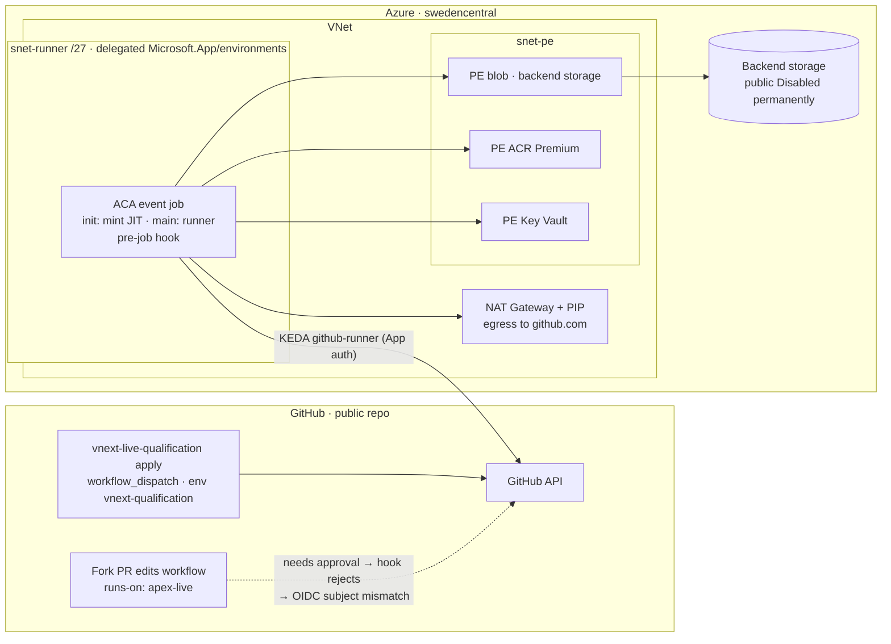

# Azure runners for `apex-vnext`: public repo with a private-endpoint-only Azure environment

> Addendum to the first report (`i-want-to-explore-how-we-can-use-runners-in-azure-.md`). Research date: 2026-10-07.
> Repository snapshot: [jonathan-vella/apex-vnext](https://github.com/jonathan-vella/apex-vnext) @ `162107172487664d1d0f638941daca5d099e35fa`.
> New constraints: **the repo is public**, and **the Azure environment allows only private endpoints**.

## Executive Summary

With these two constraints, an Azure network path is required, not optional. `vnext-live-qualification.yml` depends on briefly making the backend storage account public, and in a private-endpoint-only environment that step cannot happen. The workflow is also **already blocked today**: the only recorded security exception expired on 2026-07-21[^1][^2].

The private-network requirement is small. Only one job needs it: the live-qualification `apply`/`destroy` job. It needs blob data-plane access to the `handoff` and `tfstate` containers. Everything else is ARM-only and can stay on free GitHub-hosted runners, including the workload deployments themselves and the governance baseline[^3][^4].

Because the repo is public, any self-hosted runner can be targeted by a fork PR that edits the workflow YAML[^5][^6]. A safe design therefore needs layered controls: fork-approval settings, an environment branch rule, exact OIDC subjects, a pre-job hook baked into the runner image, and secret isolation inside the container[^7][^8][^9].

Two viable paths:

1. **Move the repo into a GitHub Team org ($4/user/month)** and use GitHub-hosted larger runners injected into your VNet. This is the simplest and cheapest path, it is supported in `swedencentral`, and GitHub manages the runners[^10][^11].
2. **Stay on the personal account** and run hardened, ephemeral Azure Container Apps (ACA) job runners in an internal, VNet-integrated environment. Budget about $110/month in fixed networking and ACR Premium costs[^12].

---

## 1. Impact of a private-endpoint-only environment on this repo

| Surface | Network need | Works on GitHub-hosted runners? |
| --- | --- | --- |
| `governance-policy-baseline.yml` | ARM only (`management.azure.com`, Entra) | ✅ Yes, no change[^4] |
| Workload deploy and destroy (Bicep AVM storage module, Terraform AVM 0.7.3 via `azapi_resource`) | ARM only | ✅ Yes[^3] |
| `azure/login` OIDC token exchange | Entra (public) | ✅ Yes |
| Live-qual `az storage blob list/download/upload` on the `handoff` container | **Blob data plane** | ❌ Needs a private endpoint[^1] |
| Terraform `azurerm` backend (`tfstate` container; `use_azuread_auth` changes only the auth method, not the network path) | **Blob data plane** | ❌ Needs a private endpoint[^3][^13] |
| **Local maintainer** preview and upload ("native preview under bounded backend firewall session") | **Blob data plane** | ❌ Also breaks; see §6[^2] |
| Log Analytics workspace (`publicNetworkAccessForIngestion/Query: Enabled`) | n/a | ⚠️ Conflicts with a private-endpoint-only posture; no recorded policy enforces it today[^14] |

### What the governance record shows

- The repo's recorded baseline for `apex-shared` shows the storage public-network policy as **`modify`** (auto-remediate), not `deny`.
- The `SecurityControl=Ignore` tag is the bypass parameter in that policy assignment. It is not an Azure Policy exemption, and the baseline records zero exemptions[^2].
- If your environment uses `deny`, which "only supports private endpoints" suggests, the workflow's `--public-network-access Enabled` call is rejected outright.

---

## 2. Option A: GitHub Team org with larger runners and Azure private networking (simplest)

### Requirements and billing

- *"Azure VNET private networking is only available for larger runners (2-64 vCPU Ubuntu and Windows)."*[^10]
- Larger runners are available on **GitHub Team or Enterprise Cloud**, so Team is enough. **SwedenCentral** is a supported region[^10].
- GitHub Team costs **$4 per user per month**[^11].
- Public repos can use larger runners, but every minute is billed (Linux 4-core: $0.012/min). Included free minutes don't apply[^15].

#### Why it fits

- GitHub manages ephemeral VMs, injected through a delegated subnet into the `GitHub.Network/networkSettings` resource.
- You don't maintain a runner image, autoscaler, GitHub App, ACR, or Key Vault.
- Runner groups become available. They default to private repos only, so you must allow public repos explicitly.

#### Repo changes caused by the transfer

- OIDC subjects change from `repo:jonathan-vella/apex-vnext:*` to `repo:<org>/apex-vnext:*`. Update the Entra federated credentials.
- Update the npm trusted-publisher configuration for each package.
- Update the hard-coded `issue_link` (`https://github.com/jonathan-vella/apex-vnext/issues/13`) checked by `validate-vnext-qualification-context.mjs`[^16].

**npm publishing:** npm says trusted publishing supports "cloud-hosted runners" and excludes only self-hosted ones. That larger runners qualify is inferred; npm doesn't name them. Keep `publish-npm` on a standard runner anyway[^17].

---

## 3. Option B: hardened ACA job runners on the personal account



### 3.1 Networking (private endpoints only)

| Element | Requirement | Source |
| --- | --- | --- |
| ACA environment | **Workload-profiles** type. Subnet ≥ /27, delegated to `Microsoft.App/environments`. `publicNetworkAccess: Disabled` (internal). | [^18] |
| Jobs | No ingress needed, so they work in an internal environment. The default-domain private DNS zone is only needed for ingress apps. | [^18] |
| Egress | UDR to Azure Firewall, or NAT Gateway (workload-profiles only). ACA platform needs `MicrosoftContainerRegistry`, `AzureFrontDoor.FirstParty`, `AzureActiveDirectory`, `AzureMonitor`, and DNS `168.63.129.16:53`. Runners also need `github.com`, `api.github.com`, and `*.actions.githubusercontent.com`. | [^18][^19] |
| KEDA polling path | **Undocumented.** It may run from the platform or from your subnet, so allow `api.github.com` either way. | [^18] |
| Storage | Blob PE + `privatelink.blob.core.windows.net` linked to the VNet | [^3] |
| ACR | **Premium** is required for private link. Use `privatelink.azurecr.io` (covers `{registry}.{region}.data.azurecr.io`). Allow ARM-audience tokens for MI pull. | [^20] |
| Key Vault refs | ACA docs don't say whether secret resolution works over a KV private endpoint. **Verify empirically.** | [^18] |
| Log Analytics | AMPLS private link. ACA-specific behaviour is inferred, not documented. | [^18] |
| NSG on runner subnet | Allow 443 to the PE subnet and the internet. **Deny other private ranges** (hub, peered VNets) so a compromised job can't move laterally. | Design recommendation |

### 3.2 Building the runner image when ACR is private-only

| Approach | Policy fit | Status | Notes |
| --- | --- | --- | --- |
| **Build on a GitHub-hosted runner, push to GHCR, then `az acr import` by digest into the private ACR** | ✅ | GA | *"…the restricted registry must allow access by trusted services… By default, this setting is enabled, so import works."* Import is a control-plane call, so the GitHub-hosted runner doesn't need a VNet[^21]. Whether GHCR supports the RFC 7233 range requests import needs is **unverified**; run a spike. |
| ACR Tasks dedicated agent pool in the VNet | ✅ | **Preview** (Sweden Central listed; isolated quota defaults to 0) | Plain `az acr build` is not a trusted service and will likely fail against a private ACR[^21] |
| ACA pulls directly from public GHCR | ⚠️ Egress to a public registry; Microsoft doesn't document the GHCR FQDNs | GA | Removes ACR Premium ($50/mo) and its PE. Check whether this meets the intent of your policy. |

Attest the image with `actions/attest` (public repos use Sigstore's public log). Pin by digest everywhere[^21].

### 3.3 Secret isolation inside the job

Microsoft's tutorial puts the GitHub token straight into the runner container's environment. That is the main thing to avoid[^9].

- **Init container** holds the GitHub App key as an env `secretRef`, calls `POST /repos/{owner}/{repo}/actions/runners/generate-jitconfig`, and writes `encoded_jit_config` to an **EmptyDir** volume. Both init containers and EmptyDir are supported for jobs[^9].
- **Main runner container** gets no `secretRef` env. It reads the JIT file, deletes it, and runs `./run.sh --jitconfig …`.
- Set **`identitySettings` lifecycle `None`** on the ACR/KV identity. This works from API `2024-02-02-preview`: *"Use this when you have a managed identity that is only used for ACR image pull, scale rules, or Key Vault secrets and does not need to be available to the code running in your containers."* Use `Init` only if the init container needs MI, which requires a workload-profiles Consumption environment[^9].
- A secret referenced only by the scale rule's `auth` is not injected into containers. This is inferred from the schema; there is no explicit quote[^9].
- Use the **KEDA scale rule** rather than a Function plus `jobs/start`. `jobs/start` can override the image and env and read any named secret on the job. If you do use it, grant a custom role with only `start/action`[^9].
- A personal account can own the GitHub App. It needs **Administration: write** on the repo, which covers `generate-jitconfig`[^22].

### 3.4 Fork-PR defence in depth (public repo)

A fork PR's `pull_request` run uses the **PR's merge commit**, including its edited workflow files. A fork PR can therefore add `runs-on: [self-hosted, apex-live]`[^5]. Public repos have no switch to disable fork PR workflows; that control is private-repo-only. Runner groups don't exist for personal accounts[^6].

| Layer | Control | Strength |
| --- | --- | --- |
| 1 | Settings → Actions → **"Require approval for all external contributors."** Approval covers the whole run, so read `.github/workflows/` diffs before approving[^6]. | Human gate |
| 2 | **`ACTIONS_RUNNER_HOOK_JOB_STARTED`** script baked into the image. It rejects unless `GITHUB_EVENT_NAME ∈ {workflow_dispatch, schedule}`, `GITHUB_REPOSITORY` matches, `GITHUB_REF == refs/heads/main`, and `GITHUB_WORKFLOW_REF` is on an allowlist. *"If there is any other exit code, the job will not run."* A fork can't change it[^7]. | **Strong, runner-side** |
| 3 | KEDA `noDefaultLabels: true` and a custom label only, so a plain `runs-on: self-hosted` can't wake the pool[^23] | Reduces exposure |
| 4 | Environment `vnext-qualification`: deployment branches = `main` only. Never add `refs/pull/*/merge`, which the docs warn would open the gate[^8]. | Blocks environment secrets and OIDC subject |
| 5 | Entra federated credential subject `repo:jonathan-vella/apex-vnext:environment:vnext-qualification`. Matching is exact and case-sensitive with no wildcards, so a fork job's `…:pull_request` subject can never exchange[^8]. | **Strong, Azure-side** |
| 6 | JIT one-shot runners, no MI available in the main container, NSG blocking lateral movement | Limits blast radius |

Not yet verified (test empirically):

- that `id-token: write` is downgraded for fork PRs
- whether collaborators with write access bypass the "all external contributors" approval[^8][^6]

---

## 4. Cost comparison (swedencentral, USD/month, Retail Prices API)

| Item | Unit price | Option A (Team + VNet injection) | Option B (ACA) | Option B lean (GHCR pull, no KV) |
| --- | --- | --- | --- | --- |
| GitHub Team | $4/user | $4.00 | — | — |
| Larger-runner minutes (~8 runs × 45 min, Linux 4-core) | $0.012/min | ≈ $4.32 | — | — |
| Private endpoints | $0.01/h each | 1 × $7.30 | 3 × $21.90 | 1 × $7.30 |
| Private DNS zones | $0.50/zone | $0.50 | $1.50 | $0.50 |
| NAT Gateway + static PIP | $0.045/h + $0.005/h | $36.50 *(if your VNet needs explicit egress; unverified for GitHub VNet injection)* | $36.50 | $36.50 |
| ACR Premium | $1.6666/day | — | $50.00 | — |
| ACA compute | free grant 180k vCPU-s / 360k GiB-s | — | ≈ $0 | ≈ $0 |
| **Fixed total** | | **≈ $12–53** | **≈ $110** | **≈ $44** |

Sources: [^12][^24].

- Replacing the NAT Gateway with **Azure Firewall Basic** adds about $255/month ($0.395/h). The Basic SKU has **no swedencentral price row**, so check its availability. Firewall Standard costs $1.25/h (about $912/month)[^12].
- A new **"Fixed Private Endpoint T1" meter at $14/h** appeared on 2026-10-01. The estimates use the standard $0.01/h PE meter; confirm which applies[^12].
- Data-processed charges ($0.01/GB for PE, $0.045/GB for NAT) are not included.

---

## 5. Workflow and validator changes (both options)

```yaml
# vnext-live-qualification.yml
validate_dispatch:
  runs-on: ubuntu-latest                       # unchanged; no data plane
apply:
  runs-on: [self-hosted, linux, apex-live]     # Option B
  # runs-on: { group: apex-vnet, labels: apex-linux-4core }   # Option A
  environment: vnext-qualification
  permissions: { contents: read, id-token: write }
  timeout-minutes: 60
```

- Delete the open and close firewall steps and the `SecurityControl=Ignore` tagging. Replace them with an `if: always()` check that the account is still `Disabled`/`Deny` with no IP rules[^1].
- Update `tools/scripts/validate-vnext-live-workflow.mjs`: the `runs-on` assertions at lines 96 and 135, and the open/close sequence assertions at 159–195[^1].
- Retire the `security_exceptions` record and the 75-minute check in `validate-vnext-qualification-context.mjs`[^16].
- Remove the "firewall rule" role from the GitHub principal and the uploader in `bootstrap.bicep`. Add the backend storage private endpoint to bootstrap[^3].
- Update `.azure/plan.md` (Security Contract, rollback section, and the approval-flow wording "under bounded backend firewall session")[^2].
- Optionally set the Log Analytics workspace to private ingestion and query through AMPLS[^14].
- Keep `ci`, `iac-checks`, `docs`, `branch-enforcement`, `release-candidate-qualification`, `windows-package-tests`, `weekly-maintenance`, `governance-policy-baseline`, and `publish-npm` on GitHub-hosted runners.

## 6. Open problem: the local maintainer also needs the private network

The approval flow starts on the maintainer's machine. It runs a "native preview under bounded backend firewall session," and the local uploader holds the firewall-management role and data access to `handoff` and `tfstate`[^2]. Under a private-endpoint-only policy, **your workstation also loses data-plane access**. Options (not researched or priced):

- Point-to-site VPN Gateway into the VNet
- A jump host or dev VM inside the VNet that runs `apex` preview and approval locally (Gate 4 stays human and local)
- Redesign the handoff so the preview step also runs on the in-VNet runner, with only the approval signed locally. This would need a design review against the "CI cannot create approval" rule[^2].

---

## Recommendation

1. **Prefer Option A** if you're willing to move the repo into a GitHub org. It is the cheapest, it is GitHub-managed, and it gives you runner groups. Budget a one-time migration of OIDC subjects, npm trusted publishers, and validator URLs.
2. **Otherwise use Option B** with every layer in §3.4. The pre-job hook and the exact OIDC subject matter most.
3. Either way, solve §6 first, or live qualification stays blocked at the local preview step even once CI works.
4. Spike these before committing: Key Vault refs over a private endpoint, `az acr import` from GHCR, the KEDA polling egress path, fork-PR `id-token` behaviour, and whether GitHub VNet injection needs explicit egress.

## Confidence Assessment

### High

- Which repo steps break and why: direct file reads; data-plane vs ARM analysis of the AVM modules and backend.
- The exception expiry date.
- Policy effects recorded in the governance JSON.
- Fork PRs run the PR's own workflow YAML.
- No fork-disable switch exists for public repos.
- Pre-job hook semantics.
- Exact matching of Entra federated-credential subjects.
- ACA networking requirements, `identitySettings` lifecycle, and init containers with EmptyDir for jobs.
- ACR Premium is required for private link, and `az acr import` works as a trusted service.
- Larger runners with VNet injection work on Team and in SwedenCentral.
- Team price, and the retail meters quoted above.

#### Medium / inferred

- That the user's environment uses `deny` rather than the recorded `modify`.
- That scale-rule-only secrets are not injected into containers.
- That npm trusted publishing accepts larger runners.
- That collaborators bypass the external-contributor approval.
- That `id-token` is downgraded on fork PRs.

#### Unverified

- The KEDA scaler's network path.
- Key Vault references over a private endpoint.
- GHCR support for `az acr import` (RFC 7233) and its egress FQDNs.
- Azure Firewall Basic in swedencentral.
- The new $14/h PE meter.
- Whether GitHub VNet injection needs NAT.
- VPN and dev-box costs for §6.

---

## Footnotes

[^1]: [.github/workflows/vnext-live-qualification.yml:138-160,208-215,261,281-294](https://github.com/jonathan-vella/apex-vnext/blob/162107172487664d1d0f638941daca5d099e35fa/.github/workflows/vnext-live-qualification.yml#L138-L294); tools/scripts/validate-vnext-live-workflow.mjs:96,135,159-195
[^2]: infra/bicep/vnext-qualification/.azure/plan.md:30-32,95-111,290-306; agent-output/vnext-qualification/04-governance-constraints.json (`security_exceptions[0]`: `expires_at: 2026-07-21T13:43:47Z`; storage policy `effect: modify`; zero exemptions); .github/data/governance-policy-baseline.json:7709-7730 (`AllowedTagName: SecurityControl`, `AllowedTagValue: Ignore`)
[^3]: [infra/bicep/vnext-qualification/main.bicep:24-41](https://github.com/jonathan-vella/apex-vnext/blob/162107172487664d1d0f638941daca5d099e35fa/infra/bicep/vnext-qualification/main.bicep#L24-L41); [infra/terraform/vnext-qualification/main.tf:20-35](https://github.com/jonathan-vella/apex-vnext/blob/162107172487664d1d0f638941daca5d099e35fa/infra/terraform/vnext-qualification/main.tf#L20-L35); infra/terraform/vnext-qualification/backend.tf, providers.tf; AVM TF module uses `azapi_resource` (.terraform/modules/storage_account/main.tf:1, modules/container/main.tf:1-11); infra/bicep/vnext-qualification/bootstrap.bicep:116-153
[^4]: [.github/workflows/governance-policy-baseline.yml:17-39](https://github.com/jonathan-vella/apex-vnext/blob/162107172487664d1d0f638941daca5d099e35fa/.github/workflows/governance-policy-baseline.yml#L17-L39); tools/scripts/collect-governance-baseline.ps1:1-13
[^5]: GitHub, events that trigger workflows (`pull_request`, forks): <https://docs.github.com/en/actions/reference/workflows-and-actions/events-that-trigger-workflows#pull_request>
[^6]: GitHub, managing Actions settings for a repository (fork approval; private-only fork toggles): <https://docs.github.com/en/repositories/managing-your-repositorys-settings-and-features/enabling-features-for-your-repository/managing-github-actions-settings-for-a-repository>; limiting self-hosted runners (org-only): <https://docs.github.com/en/organizations/managing-organization-settings/disabling-or-limiting-github-actions-for-your-organization>
[^7]: GitHub, running scripts before or after a job: <https://docs.github.com/en/actions/how-tos/manage-runners/self-hosted-runners/run-scripts>
[^8]: GitHub deployments and environments: <https://docs.github.com/en/actions/reference/workflows-and-actions/deployments-and-environments>; OIDC subject claims: <https://docs.github.com/en/actions/reference/security/oidc>; workflow permissions: <https://docs.github.com/en/actions/reference/workflows-and-actions/workflow-syntax#permissions>; Entra workload identity federation: <https://learn.microsoft.com/en-us/entra/workload-id/workload-identity-federation-create-trust>
[^9]: Microsoft Learn, ACA managed identity ("Control managed identity availability"): <https://learn.microsoft.com/en-us/azure/container-apps/managed-identity>; jobs ARM schema: <https://learn.microsoft.com/en-us/azure/templates/microsoft.app/jobs>; containers / init containers: <https://learn.microsoft.com/en-us/azure/container-apps/containers>; storage mounts (EmptyDir): <https://learn.microsoft.com/en-us/azure/container-apps/storage-mounts>; manage secrets: <https://learn.microsoft.com/en-us/azure/container-apps/manage-secrets>; jobs (start permission warning): <https://learn.microsoft.com/en-us/azure/container-apps/jobs>; tutorial: <https://learn.microsoft.com/en-us/azure/container-apps/tutorial-ci-cd-runners-jobs>; GitHub secure use (JIT): <https://docs.github.com/en/actions/reference/security/secure-use>
[^10]: GitHub, about Azure private networking for GitHub-hosted runners: <https://docs.github.com/en/organizations/managing-organization-settings/about-azure-private-networking-for-github-hosted-runners-in-your-organization>
[^11]: GitHub pricing (Team $4/user/month): <https://github.com/pricing>
[^12]: Azure Retail Prices API (`https://prices.azure.com/api/retail/prices`): Private Endpoint, Azure DNS, NAT Gateway, Public IP, Azure Firewall, Container Registry; queried 2026-10-07
[^13]: Terraform azurerm `storage_account` docs (`public_network_access`, `storage_use_azuread`): <https://registry.terraform.io/providers/hashicorp/azurerm/latest/docs/resources/storage_account>
[^14]: [infra/bicep/vnext-qualification/bootstrap.bicep:88-90](https://github.com/jonathan-vella/apex-vnext/blob/162107172487664d1d0f638941daca5d099e35fa/infra/bicep/vnext-qualification/bootstrap.bicep#L88-L90)
[^15]: GitHub Actions runner pricing: <https://docs.github.com/en/billing/reference/actions-runner-pricing>
[^16]: tools/scripts/validate-vnext-qualification-context.mjs:10,42-125; tools/scripts/_lib/security-exceptions.mjs:21-29
[^17]: npm trusted publishers: <https://docs.npmjs.com/trusted-publishers>
[^18]: Microsoft Learn, ACA networking: <https://learn.microsoft.com/en-us/azure/container-apps/networking>; private endpoints: <https://learn.microsoft.com/en-us/azure/container-apps/how-to-use-private-endpoint>; custom VNets: <https://learn.microsoft.com/en-us/azure/container-apps/custom-virtual-networks>; UDR: <https://learn.microsoft.com/en-us/azure/container-apps/user-defined-routes>; firewall integration: <https://learn.microsoft.com/en-us/azure/container-apps/firewall-integration>; scaling: <https://learn.microsoft.com/en-us/azure/container-apps/scale-app>; DNS: <https://learn.microsoft.com/en-us/azure/container-apps/private-endpoints-with-dns>; Azure Monitor private link: <https://learn.microsoft.com/en-us/azure/azure-monitor/fundamentals/private-link-security>
[^19]: Microsoft Learn, ACA with Azure Firewall (FQDN rules): <https://learn.microsoft.com/en-us/azure/container-apps/use-azure-firewall>; GitHub Meta API guidance: <https://docs.github.com/en/authentication/keeping-your-account-and-data-secure/about-githubs-ip-addresses>
[^20]: Microsoft Learn, ACR private endpoints: <https://learn.microsoft.com/en-us/azure/container-registry/container-registry-private-endpoints>; dedicated data endpoints: <https://learn.microsoft.com/en-us/azure/container-registry/container-registry-dedicated-data-endpoints>; ACA MI image pull: <https://learn.microsoft.com/en-us/azure/container-apps/managed-identity-image-pull>
[^21]: Microsoft Learn, ACR import: <https://learn.microsoft.com/en-us/azure/container-registry/container-registry-import-images>; trusted services: <https://learn.microsoft.com/en-us/azure/container-registry/allow-access-trusted-services>; Tasks agent pools: <https://learn.microsoft.com/en-us/azure/container-registry/tasks-agent-pools>; GitHub artifact attestations: <https://docs.github.com/en/actions/concepts/security/artifact-attestations>; GHCR: <https://docs.github.com/en/packages/working-with-a-github-packages-registry/working-with-the-container-registry>
[^22]: GitHub REST self-hosted runners: <https://docs.github.com/en/rest/actions/self-hosted-runners>; GitHub App permissions: <https://docs.github.com/en/rest/authentication/permissions-required-for-github-apps>; registering a GitHub App (personal account): <https://docs.github.com/en/apps/creating-github-apps/registering-a-github-app/registering-a-github-app>
[^23]: KEDA `github-runner` scaler: <https://keda.sh/docs/2.21/scalers/github-runner/>
[^24]: Azure Container Apps pricing (free grant): <https://azure.microsoft.com/en-us/pricing/details/container-apps/>
