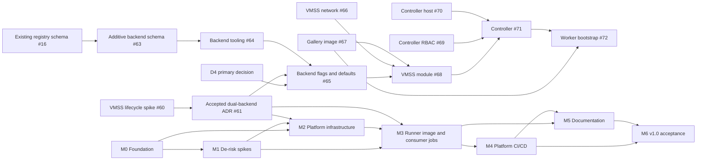

# Roadmap

Milestones are sequential gates. Each one has exit criteria and maps to a GitHub milestone. Work items for each
milestone are listed in the [backlog](backlog.md) and tracked as GitHub issues. The dual-backend planning tracker is
[#59](https://github.com/jonathan-vella/azure-gh-runners/issues/59).

| Milestone | Goal | Exit criteria |
| --- | --- | --- |
| **M0 - Foundation** | Repository, identities, and GitHub App exist; agents can work in the repo. | Branch protection active; layout scaffolded; `AGENTS.md` complete; OIDC credentials and `platform-prod` environment configured; GitHub App created with runbooks. |
| **M1 - De-risk spikes** | Prove preview and undocumented behaviours before building on them. | Existing ADR-0001 to ADR-0005 accepted; VMSS spike #60 completes within its approved limits and the spike RG is deleted and verified on every outcome; dual-backend ADR #61 records the evidence and is accepted before persistent VMSS work. |
| **M2 - Platform infrastructure** | Private-endpoint-only shared and VMSS network foundations deploy cleanly. | Shared network, observability, Key Vault, ACR, and selected backend infrastructure build/lint cleanly; controller/worker subnet rules preserve no inbound access, no worker identity, `defaultOutboundAccess: false`, and NAT-only public IP. |
| **M3 - Runner image and consumer jobs** | Hardened image and registry-driven execution on one or both explicitly enabled backends. | Additive backend schema preserves current consumers; backend tooling and flags follow the accepted primary decision; VMSS image, module, controller RBAC/host, lifecycle, and bootstrap meet their issue gates; ACA work remains available and unchanged unless the primary decision explicitly changes its priority. |
| **M4 - Platform CI/CD** | The repo runs itself through its protected workflows. | Required PR validation with what-if; main-only `platform-prod` deployment with post-deploy assertions; weekly maintenance workflow. |
| **M5 - Documentation** | An agent can operate and onboard without extra context. | Architecture, onboarding, operations, security, dual-backend decisions, and RBAC/runbook guidance are complete and linked from `AGENTS.md`. |
| **M6 - v1.0 acceptance** | Prove the selected backend end to end. | Smoke-test consumer passes all checks for the selected backend; automated no-public-endpoint check is green; required M0-M5 work is complete; `v1.0.0` tagged. Backend choice follows the evidence rule below; #74 is not a v1.0 dependency. |

## Backend decision and gates

The primary backend and active defaults are **unresolved**. The latest owner-authorized non-zonal ACA D4 attempt used
reviewed source `e934066c3c1cb43fa33cf7ee835389f03de48389`. Observed activity shows the ARM validation action was
asynchronously accepted; no deployment write or ACA managed-environment write was observed, and inventory confirmed
zero deployments/resources. The original CLI exit was 1 (`Unclassified`), readback was `DeploymentNotFound`, and
independent diagnosis was `DeploymentAbsentOwnedGroupEmpty`. Offline mocks demonstrate that an accepted asynchronous
validation can later return an error before deployment creation, but this is only a possible control-flow explanation,
not evidence of what happened in the real attempt. The actual cause is unknown. Cleanup succeeded and the exact
`rg-ghrunners-spike7-swc` resource group was verified absent. No ACA environment create or job run was observed. This
is not evidence of ACA capacity failure and does not select VMSS as primary. See
[the recorded D4 outcome](https://github.com/jonathan-vella/azure-gh-runners/issues/7#issuecomment-6045915111).
The additional D4 authorization has been consumed; no further retry is authorized.

Apply the approved conditional rule:

- An actual D4 environment provision **and** a D4 job running successfully selects ACA primary. The corresponding
  defaults are `backend: "aca"`, `enableAca=true`, and `enableVmss=false`.
- Repeated actual capacity failure selects VMSS primary. The corresponding defaults are `backend: "vmss"`,
  `enableVmss=true`, and `enableAca=false`.
- Any other outcome leaves the primary and defaults unresolved. Do not change the active registry contract or
  reprioritize/relabel the ACA track while unresolved.

The additive schema preparation in #63 may proceed without a D4 verdict or completed VMSS spike, but it must not set
a default or change existing ACA entries. Registry tooling, backend runtime behavior, and deployment flags follow the
accepted ADR and D4 decision. The VMSS spike #60 and accepted ADR #61 gate persistent VMSS implementation. A failed or
inconclusive VMSS spike blocks production VMSS work. Preserve separate, independent `enableAca` and `enableVmss` flags
so both backends can be intentionally enabled.

The VMSS design uses a pinned `actions/scaleset` Go client v0.4.0 (Public Preview), a private B-series Linux controller
running under systemd, and one zero-idle VMSS Flex per consumer. Workers are Linux/non-root, have no Docker or managed
identity, use `defaultOutboundAccess: false`, and receive one-time JIT data only through protected Custom Script
Extension settings. The native Compute Gallery image is built with VM Image Builder and reuses the exact tool manifest
and pre-job hook. NAT is the sole public IP; no inbound worker endpoints are allowed.

Production controller RBAC is limited to Virtual Machine Contributor and Network Contributor for the controller
identity at `rg-ghrunners-prod-swc`. The existing deployment service principal condition currently allows only
AcrPull, AcrPush, and Key Vault Secrets User. After the controller-RBAC runbook PR merges, the one-time condition
update may add only those two role IDs while preserving all existing scope/action constraints. Verify and record the
exact change; stop on unexpected state. Bicep role assignments deploy only through the main-only `platform-prod`
workflow. No cloud changes are authorized by this planning update.

## After v1.0 (not scheduled)

- Onboard `apex-vnext` as the first real consumer (separate plan in that repository).
- Optional per-consumer subnet or environment isolation for high-sensitivity consumers.
- Optional additional image variants if consumers need tools beyond the generic set.
- Revisit GitHub organization + larger runners with VNet injection if repositories move into an organization.
