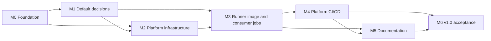

# Roadmap

Milestones are sequential gates. Each one has exit criteria and maps to a GitHub milestone. Work items for each
milestone are listed in the [backlog](backlog.md) and tracked as GitHub issues.

| Milestone | Goal | Exit criteria |
| --- | --- | --- |
| **M0 - Foundation** | Repository, identities, and GitHub App exist; agents can work in the repo. | Branch protection active; layout scaffolded; `AGENTS.md` complete; OIDC credentials and `platform-prod` environment configured; GitHub App created with runbooks. |
| **M1 - Default decisions** | Record v1 decisions without further spikes. | ADR-0001 to ADR-0005 accepted as defaults pending live smoke; ADR-0006 (VMSS Flex) rejected for v1. |
| **M2 - Platform infrastructure** | Private-endpoint-only shared foundation deploys cleanly. | Network, observability, Key Vault, ACR, and internal ACA environment build/lint cleanly and deploy with `deployJobs=false`; no inbound access and NAT-only public IP. |
| **M3 - Runner image and consumer jobs** | Hardened image and registry-driven ACA jobs. | Image imported into ACR by digest; one ACA job per registry entry deploys with `deployJobs=true`; registry accepts only the `aca` backend. |
| **M4 - Platform CI/CD** | The repo runs itself through its protected workflows. | Required PR validation (`validate.yml` running `npm run validate`); main-only `platform-prod` staged deployment (`deploy.yml`) with post-deploy assertions; weekly maintenance workflow. |
| **M5 - Documentation** | An agent can operate and onboard without extra context. | Architecture, onboarding, operations, and security guidance are complete and linked from `AGENTS.md`. |
| **M6 - v1.0 acceptance** | Prove ACA end to end. | A smoke workflow in public `jonathan-vella/ghr-smoke` runs on the real ACA runner and lists an anonymous-read, empty blob container in a storage account with public network access disabled, reached only through a private endpoint in `snet-consumer-pe`; automated no-public-endpoint check is green; `v1.0.0` tagged. #74 is not a v1.0 dependency. |

## v1 decisions (2026-10-08)

- v1 uses Azure Container Apps jobs only. Deploy directly into the existing empty `rg-ghrunners-prod-swc` through the
  `platform-prod` OIDC workflow: GitHub-hosted image build → private GHCR → foundation (`deployJobs=false`) →
  `az acr import` by digest into ACR (trusted-services bypass on) → jobs (`deployJobs=true`).
- No further spikes. Archival spike harnesses stay on disk but are not part of `npm run validate`.
- Merge bar: CI build, `npm run validate`, and one agent code review with no blocking findings, then agent merge.

**Historical (superseded):** the dual-backend plan (tracker #59, VMSS issues #60–#72, #81, #84), the D4 evidence rule,
and the VMSS controller design are superseded by the ACA-only decision; see
[ADR-0006](adr/0006-vmss-flex-spike.md). The VMSS issues will be closed.

## After v1.0 (not scheduled)

- Onboard `apex-vnext` as the first real consumer (separate plan in that repository).
- Optional per-consumer subnet or environment isolation for high-sensitivity consumers.
- Optional additional image variants if consumers need tools beyond the generic set.
- Revisit a VMSS Flex backend only if ACA proves insufficient ([ADR-0006](adr/0006-vmss-flex-spike.md)).
- Revisit GitHub organization + larger runners with VNet injection if repositories move into an organization.
