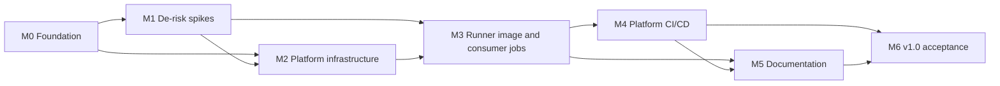

# Roadmap

Milestones are sequential gates. Each one has exit criteria and maps to a GitHub milestone. Work items for each
milestone are listed in the [backlog](backlog.md) and tracked as GitHub issues.

| Milestone | Goal | Exit criteria |
| --- | --- | --- |
| **M0 - Foundation** | Repository, identities, and GitHub App exist; agents can work in the repo. | Branch protection active; layout scaffolded; `AGENTS.md` complete; OIDC credentials and `platform-prod` environment configured; GitHub App created with runbooks. |
| **M1 - De-risk spikes** | Prove preview and undocumented behaviours before building on them. | ADR-0001 to ADR-0005 accepted (image build path, Key Vault references, egress, secret isolation, labels); spike resources deleted. |
| **M2 - Platform infrastructure** | Private-endpoint-only foundation deploys cleanly. | Network, observability, Key Vault, ACR, and ACA environment deploy with `bicep lint` clean and no public network access on any PaaS resource. |
| **M3 - Runner image and consumer jobs** | Hardened image and registry-driven jobs. | Image builds in Azure; registry validator enforces the policy floor; one job per registry entry deploys from generated params; hook tests pass. |
| **M4 - Platform CI/CD** | The repo runs itself. | Required PR validation with what-if; gated `platform-prod` deployment with post-deploy assertions; weekly maintenance workflow. |
| **M5 - Documentation** | An agent can operate and onboard without extra context. | Architecture, onboarding, operations, and security docs complete and linked from `AGENTS.md`. |
| **M6 - v1.0 acceptance** | Prove it end to end. | Smoke-test consumer passes all checks; automated no-public-endpoint check green; `v1.0.0` tagged. |

## After v1.0 (not scheduled)

- Onboard `apex-vnext` as the first real consumer (separate plan in that repository).
- Optional per-consumer subnet or environment isolation for high-sensitivity consumers.
- Optional additional image variants if consumers need tools beyond the generic set.
- Revisit GitHub organization + larger runners with VNet injection if repositories move into an organization.
